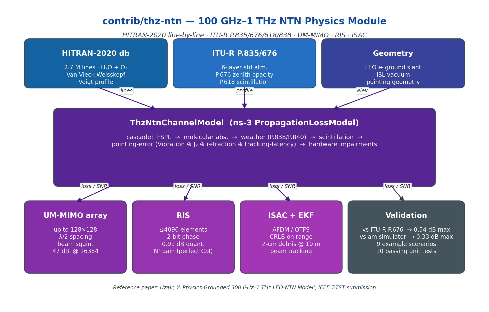
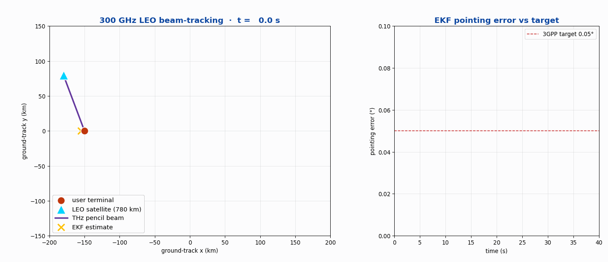
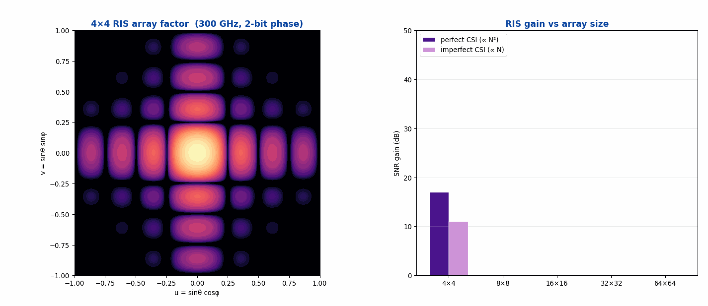

<h1 align="center">thz-ntn</h1>

<p align="center"><strong>100 GHz – 1 THz physics module for ns-3.43 — HITRAN-2020 line-by-line, ITU-R P.835/676/618/838, UM-MIMO, RIS, ISAC</strong></p>

<p align="center">
  <a href="https://www.nsnam.org"></a>
  <a href="https://www.gnu.org/licenses/old-licenses/gpl-2.0.en.html"></a>
  
  
  
</p>

<p align="center">
  
</p>

---

## Why this module

The 100 GHz – 1 THz window is the near-term target for high-capacity satellite ISL and ground links — but until now ns-3 had no **physics-grounded** propagation, beam-tracking, or ISAC stack at these frequencies. `thz-ntn` provides one. The composite channel cascades **FSPL → HITRAN-2020 molecular absorption → weather (P.838/P.840) → P.618 scintillation → composite pointing error → hardware impairments**, all validated against ITU-R P.676-13 (residual ≤ 0.54 dB) and the *am* atmospheric simulator (residual ≤ 0.33 dB).

## At a glance

| Metric | Value |
|---|---|
| Frequency range | **100 GHz – 1 THz** |
| HITRAN-2020 absorption lines | 2.7 M (H₂O + O₂, Van Vleck-Weisskopf, Voigt) |
| Atmospheric profile | ITU-R P.835 6-layer standard |
| UM-MIMO array sizes | up to **128×128** (47 dBi @ 16 384 elements) |
| RIS sizes | up to 4 096 elements with 2-bit phase quantisation |
| ISAC range CRLB (2-cm debris) | **5.1 m @ 8.2 dB SNR @ 10 m** |
| Validation residual vs ITU-R P.676 | **≤ 0.54 dB** |
| Tests | **12 / 12 passing** · 9 example scenarios |

## What it does

- `ThzNtnChannelModel` (extends ns-3 `PropagationLossModel`) — composite cascade
- HITRAN-2020 line-by-line integrator over an ITU-R P.835 6-layer atmosphere
- ITU-R P.618 amplitude + phase scintillation (extended into the strong-turbulence regime)
- Composite pointing-error model: vibration ⊕ J₂ perturbation ⊕ atmospheric refraction ⊕ tracking latency
- UM-MIMO array helper (UPA / UCA / Cassegrain) with beam-squint and DFT codebook
- EKF beam tracker for satellite-ephemeris-assisted LEO pointing
- RIS (space / aerial / ground) with N² perfect-CSI scaling and 2-bit quantisation loss model
- ISAC subsystem: CRLB on range for 2-cm / 10-cm / 1-m debris classes at 300 GHz
- 5 candidate waveforms (OFDM / DFT-s-OFDM / OTFS / AFDM / SC-FDE)
- 9 reference scenarios + 12 unit tests, all under `examples/` and `test/`

## Live demos

### LEO 300 GHz beam-tracking — EKF pointing-error vs 3GPP target

<p align="center">
  
</p>

### Reconfigurable Intelligent Surface — array-factor sweep & SNR gain

<p align="center">
  
</p>

## Install & run

See [**INSTALL.md**](INSTALL.md) for full setup.

Quick taste:

```bash
git clone https://github.com/Muhammaduazir69/ns3-thz-ntn.git contrib/thz-ntn
./ns3 configure --enable-examples --enable-tests
./ns3 build thz-ntn
./ns3 run "thz-ntn-demo --example=7"     # atmospheric windows
./ns3 run "thz-ntn-demo --example=8"     # 600-s LEO beam-tracking pass
```

## Documentation

- [INSTALL.md](INSTALL.md) — full setup + dependency notes
- [docs/architecture.png](docs/architecture.png) — module architecture
- Reference paper: *A Physics-Grounded 300 GHz – 1 THz LEO-NTN Model*, IEEE T-TST, in submission

## Cite this work

```bibtex
@misc{uzair2026thzntn,
  author = {Uzair, Muhammad},
  title  = {thz-ntn: 100 GHz – 1 THz Physics Module for ns-3.43 LEO-NTN},
  year   = {2026},
  url    = {https://github.com/Muhammaduazir69/ns3-thz-ntn}
}
```

## Part of the ns3-ntn-toolkit

| Module | Repo |
|---|---|
| Toolkit (umbrella) | [ns3-ntn-toolkit](https://github.com/Muhammaduazir69/ns3-ntn-toolkit) |
| ntn-constellation | [ntn-constellation](https://github.com/Muhammaduazir69/ntn-constellation) |
| ntn-rrc | [ntn-rrc](https://github.com/Muhammaduazir69/ntn-rrc) |
| ntn-observability | [ntn-observability](https://github.com/Muhammaduazir69/ntn-observability) |
| ns3-ai (fork) | [ns3-ai](https://github.com/Muhammaduazir69/ns3-ai) |
| ntn-sagin | [ntn-sagin](https://github.com/Muhammaduazir69/ntn-sagin) |
| ntn-slice | [ntn-slice](https://github.com/Muhammaduazir69/ntn-slice) |
| ntn-v2x | [ntn-v2x](https://github.com/Muhammaduazir69/ntn-v2x) |
| ntn-traffic | [ntn-traffic](https://github.com/Muhammaduazir69/ns3-ntn-toolkit/tree/main/ns-3-dev/contrib/ntn-traffic) |
| ntn-sionna | [ntn-sionna](https://github.com/Muhammaduazir69/ntn-sionna) |
| ntn-digital-twin | [ntn-digital-twin](https://github.com/Muhammaduazir69/ntn-digital-twin) |
| ntn-cho | [ntn-cho-framework](https://github.com/Muhammaduazir69/ntn-cho-framework) |
| oran-ntn | [oran-ntn](https://github.com/Muhammaduazir69/oran-ntn) |
| **thz-ntn** | this repo |

## License

GPL-2.0-only — see [LICENSE](LICENSE).

## Acknowledgements

ns-3 core team · SNS3 maintainers · HITRAN team (CFA Harvard) · *am* atmospheric simulator (Paine, SAO) · ITU-R P.676/P.618/P.835 specifications.
